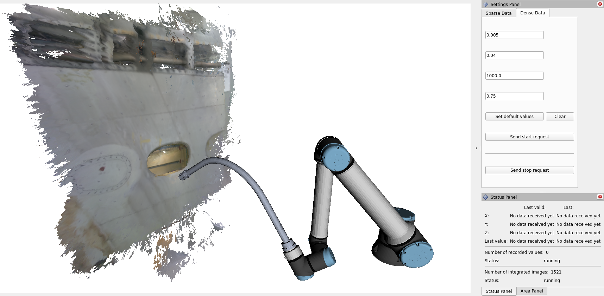
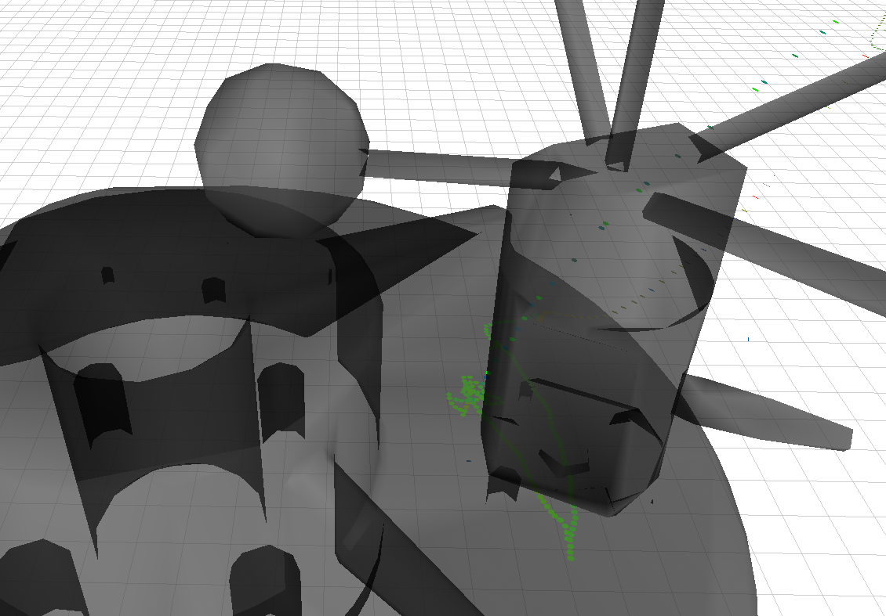

# Vinspect ROS2

This package provides the ROS2 interface for the [Vinspect software](https://github.com/DLR-MO/vinspect).

Example of an inspection with RGB-D data from a robot.

Example of an inspection with a handheld ultrasonic sensor, using the setup described in Wilken et al. "Localisation of Ultrasonic NDT Data Using Hybrid Tracking of Component and Probe".

## Installation
There are four colcon packages that you need to build:
- [vinspect](https://github.com/DLR-MO/vinspect) (the core of vinspect)
- [vinspect_msgs](https://github.com/DLR-MO/vinspect_msgs) (the message definitions)
- [vinspect_rviz_plugins](https://github.com/DLR-MO/vinspect_rviz_plugins) (RViz2 plugins for better visualisation)
- [vinspect_ros2](https://github.com/DLR-MO/vinspect_ros2) (the ROS2 interface)

Clone these packages in your colcon workspace (beware that the `vinspect` package has a git submodule that might need to intantiate) and call `colcon build`.

## Usage
This package provides a node that you can launch with specifying mutliple parameters (see below).
By setting these parameters, it is possible to subscribe on multiple different sensor inputs.
These will then be aggregated and visualized using RViz2 with additional plugins (see below).
For more details on the vinspect software itself, see the [Vinspect package](https://github.com/DLR-MO/vinspect).

### Recording
Currently, two different types of sensor inputs are supported:
- `vinspect_msgs/Sparse` messages 
- `RGB-D` images (via color and depth `sensor_msgs/Image` messages)
  
For the `Sparse` messages, it is expected that the user implements an additional preprocessing node 
that takes in some sort of point meassurement (e.g. from a ultrasonic sensor) and connects it to the
pose in which the measurement was taken.
Additionally, each sensor needs to have a unique ID.
The message can contain multiple data entries and also a custom color in which this data should be displayed.
This approach was taken since there is no standard message for all types of sensor inputs.
As soon as the Vinspect node is started, it will record these messages.

The `RGB-D` messages are only recorded after calling the `/vinspect/start_reconstruction` service
to prevent recording images before the camera is at the correct position.
This service can also be called with the Vinspect settings RViz2 plugin.
It is possible to use multiple cameras at the same time.

### Visualization
The visualization is integrated into RViz2.
Both, the sparse measurement visualization and the 3D reconstruction based on RGB-D data, are 
published as `visualization_msgs/Marker` messages.
They can be displayed with the standard RViz marker visualization.
Additionally, the [vinspect_rviz_plugins](https://github.com/DLR-MO/vinspect_rviz_plugins) package 
provides three plugins for RViz2:
- a settings plugin which allows you to configure the visualization of both sparse and dense data
- a status panel which provides the current status of the inspection, e.g. how many measurements 
  have been taken
- an area plugin which works together with an interactive marker which allows you to investigate
  measurements at a certain location. The interactive marker needs to launched with 
  `ros2 run vinspect_ros2 selection_marker.py` (or from your launch file)

### Parameters

### General Parameters
- `ref_mesh_path` (`string`): The path to the reference mesh file. Can be a normal path or a ROS2 style path(`package://PACKAGE_NAME/FOLDER/FILE.stl`).
- `frame_id` (`string`): The frame in which the inspection is taking place. Typically `world` or `base_link`.
- `inspection_space_min` (`float array`): Defines the boundaries of the space in which measurements are recorded. Values are given as a 3D array in meters, e.g. `[-1.0, -1.0, -1.0]`.
- `inspection_space_max` (`float array`): See parameter before.
- `sensor_types` (`string list`): List of sensor types that will be used. Needs to be a list of strings being either `"SPARSE"` or `"RGB-D"`.
- `save_path` (`string`): Path to where the inspection is saved. If not specified, it will not be saved.
- `load_path` (`string`): If specified, a previously saved inspection will be loaded and any new measurements will be appended to it.

### Sparse Parameters
- `sensor_data_type_names` (`string list`): Names for the data that is expected in the sparse messages (only as a human identifier).
- `sensor_data_type_units` (`string list`): Units for the data that is expected in the sparse messages.
- `value_to_display` (`string`): Which of the values that is transmitted should be shown in the visualization.
- `round_to_decimals` (`int`): To how many decimal places the values should be rounded (only in the interface, not in the recorded file). Default is `-1` and means no rounding. For example, `2` would round to `0.01`.
- `sparse_min_color_values` (`float array`): All values below this will be displayed with the lowest color of the color range. This can be a helpful setting if you just want to make the classification between okay and defect values more visible.
- `sparse_max_color_values` (`float array`): See parameter above.
- `sparse_topic`: The topic which will be subscribed for the sparse messages.
  
### Dense Parameters

- `rgbd_color_topics` (`string list`): The topics with the color images.
- `rgbd_depth_topics` (`string list`): The topics with the depth images.
- `rgbd_info_topics` (`string list`): The topics with the camera info messages.

## Demo
You can get a better impression on how this package works with the following demos.

### Sparse Data
Launch the inspection:
`ros2 launch vinspect_ros2 sparse_demo.launch.py`

You should now be presented with the RViz GUI including the special Vinspect plugins (on the right side).
There should be a reference box visible, if not try adjusting the transparency on the right.

Start a dummy publisher:
`ros2 run vinspect_ros2 dummy_publisher.py`

Now randomly generated measurements should appear in form of octagons.

Watch how the dummy data is recieved and saved concurrently:
`watch -n 0.1 tail -n 10 /tmp/demo.vinspect`

Stop the software by pressing `Ctrl+C`.

Run again the same command to load the previous data and allow continuing the inspection:
`ros2 launch vinspect_ros2 sparse_demo.launch.py`

You can move the interactive marker to investigate the measurement values.
You can adapt settings in the settings panel.

### Dense Data
You can see how the software is started in the `dense_demo.launch.py` file.

**TODO provide link to a rosbag to allow actually reconstructing**

# Contributing
Contributions are welcome (issues as well as pull requests).
We plan on further developing and using this software in the future and are happy for any 
contributions from the community.
We follow the [ROS2 code style](https://docs.ros.org/en/rolling/The-ROS2-Project/Contributing/Code-Style-Language-Versions.html).